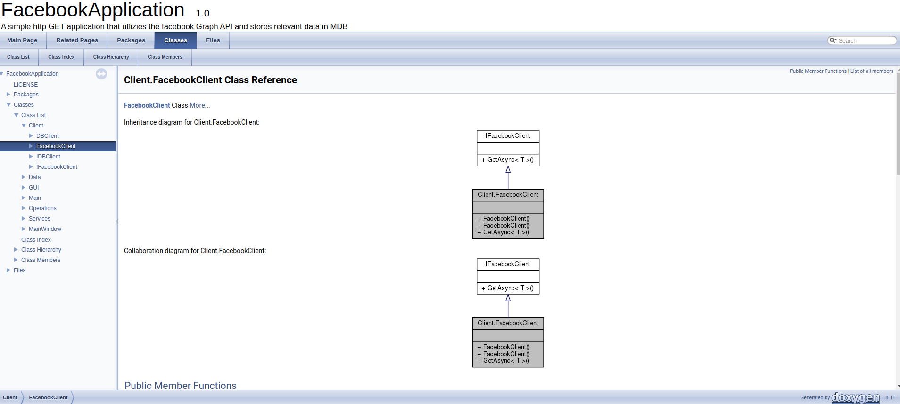

# C\# Console Application for Facebook Graph API interaction
This application consists of an extensive library of modules/methods for:

* HTTP client for request/response handling to the Facebook Graph API
* MongoDB library for saving/reading asynchronously to a local instance
* Library for generating dynamic query URI's to the API
* Streamreader class for reading OAuth-token generated via Python script
* Incomplete mapping of json data-structure using .NET objects
* Proxy Handling methods

## Purpose
The aim of this software-project is to decode and store all relevant data of the Facebook Graph API in a general solution that can take any argument to page-name. 

Ultimately this data is to be used for improvement on online/social-media prescence by identification of unsatisfied customers and train a neural-net on customer reply text-data - this should help us understand how social dynamics and customer interaction can be used in a customer servivce context.


## Docs
Docs are already generated and located in Production/Documentation/html. Run in browser: 
```sh
chromium-browser index.html
```
Should look like this: 



## To Do's

* ~~Posts~~ 
* Post-comments
* Feed
* Refactoring
* Testing

